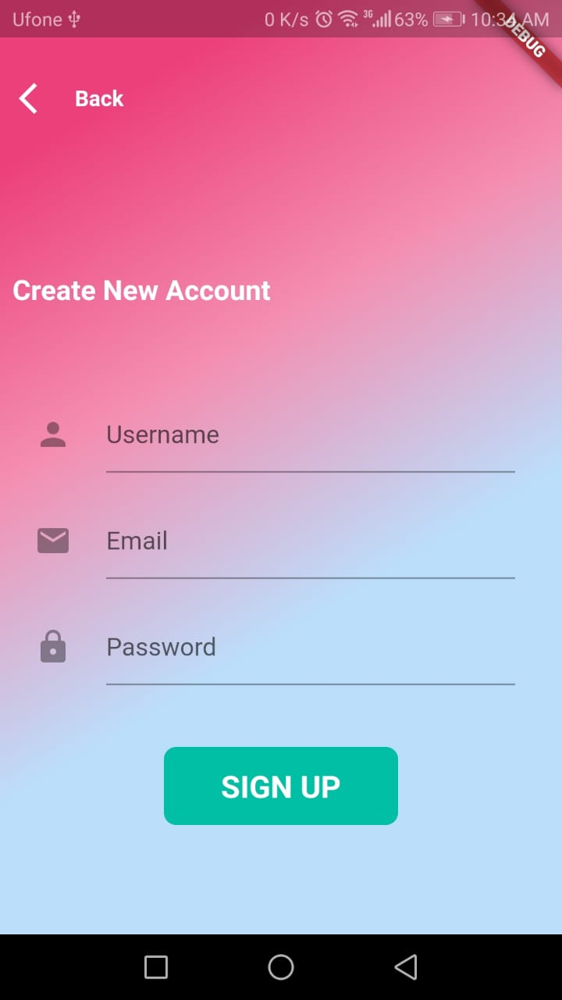

# labfinal

  SPLASH SCREEN   <kbd></kbd>
   
 
  
   LOGIN PAGE <kbd></kbd>
 
 
   SIGNUP PAGE <kbd></kbd>
 
 
 MAIN ADDED NOTE SCREEN   <kbd></kbd>
 
 
 SEARCHING NOTE <kbd></kbd>
  
 
VIEW NOTES <kbd></kbd>
   
 
  DELETE NOTES  <kbd></kbd>
  
 
   SETTING VIEW  <kbd></kbd>
    
 
UPDATE NOTES   <kbd></kbd>
 
 
ADd new  <kbd></kbd>
 
 
SHARE ON WHATSSAPP  <kbd></kbd>
## Getting Started

This project is a starting point for a Flutter application.

A few resources to get you started if this is your first Flutter project:

- [Lab: Write your first Flutter app](https://flutter.dev/docs/get-started/codelab)
- [Cookbook: Useful Flutter samples](https://flutter.dev/docs/cookbook)

For help getting started with Flutter, view our
[online documentation](https://flutter.dev/docs), which offers tutorials,
samples, guidance on mobile development, and a full API reference.
